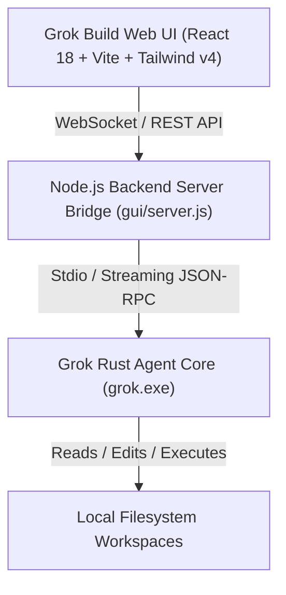

<div align="center">

<h1>
  <picture>
    <source media="(prefers-color-scheme: dark)" srcset="https://media.x.ai/v1/website/spacexai-symbol-white-transparent-0c31957f.png">
    <source media="(prefers-color-scheme: light)" srcset="https://media.x.ai/v1/website/spacexai-symbol-black-transparent-6435cf42.png">
    
  </picture>
  <br>
  Grok Build Web UI
</h1>

**Grok Build Web UI** is an ultra-modern Web GUI Workbench for SpaceXAI's **Grok Build** AI coding agent. It converts the terminal CLI into a full-featured multi-project IDE with live step-by-step reasoning, workspace file management, and real-time execution streaming.

[](LICENSE)
[](https://x.ai/cli)
[](https://x.ai)
[](https://nodejs.org)

[Features](#-key-features) ·
[Architecture](#-architecture) ·
[Quickstart](#-quickstart--installation) ·
[Usage Guide](#-usage-guide) ·
[Repository Layout](#-repository-layout) ·
[License](#-license)

</div>

---

## 🔥 Key Features

| Feature | Description |
| :--- | :--- |
| **📁 Multi-Project Workbench** | Browse, switch, and manage multiple local project folders in one unified sidebar. |
| **🧠 Live Step-by-Step Reasoning** | Real-time token streaming of Grok's internal thought process (`grok-4.5`). |
| **⚡ Real-time Step Execution Cards** | Live progress cards for file creations, refactors, and terminal command executions. |
| **⚙️ Dynamic Model Selector** | Automatically discovers available Grok models (`grok-4.5`, `grok-3`, etc.). |
| **🛡️ Auto-Approve Permissions** | One-click toggle to auto-approve tool executions (`--always-approve`). |
| **🌿 Git Worktree Mode** | Execute prompts inside isolated git worktrees (`--worktree`). |
| **🎨 SpaceXAI Dark Aesthetics** | High-contrast obsidian slate theme (`#090c15`) with cyan & emerald glow accents. |
| **📄 Code & Diff Viewer** | Integrated file explorer and syntax-highlighted code inspector. |

---

## 🏗️ Architecture



---

## 🚀 Quickstart & Installation

### Prerequisites

1. **Install Grok CLI**:
   - **Windows (PowerShell)**:
     ```powershell
     irm https://x.ai/cli/install.ps1 | iex
     ```
   - **macOS / Linux**:
     ```bash
     curl -fsSL https://x.ai/cli/install.sh | bash
     ```

2. **Authenticate Grok**:
   ```bash
   grok login --device-auth
   ```

3. **Node.js**: Ensure Node.js `v18+` is installed.

---

### Setup & Run Web UI

```bash
# Clone the repository
git clone https://github.com/himalayladha/grok-build-web-ui.git
cd grok-build-web-ui/gui

# Install dependencies
npm install

# Build production bundle
npm run build

# Start the Web UI server
npm start
```

Open your browser at **[http://localhost:3001](http://localhost:3001)**.

---

## 💡 Usage Guide

### 1. **Switching / Creating Projects**
- Use the **Projects** sidebar on the left to switch between local project folders.
- Click **`+`** (Create Folder) to create a brand new local project directory.
- Click **`+ New Conversation`** to start a clean AI turn history.

### 2. **Creating & Managing Files**
- Click **`📄`** (New File) or **`📁`** (New Subfolder) to create files directly inside the active project folder.
- Hover over any file to reveal the **🗑️ Delete** button.

### 3. **Executing Agent Prompts**
- Type your prompt in the prompt bar at the bottom and press <kbd>Ctrl</kbd> + <kbd>Enter</kbd>.
- Watch Grok reason, modify files, and execute shell commands step-by-step in real-time.

---

## 📁 Repository Layout

```
grok-build-web-ui/
├── gui/
│   ├── src/
│   │   ├── App.jsx           # Main Web UI Studio application & step stream
│   │   ├── main.jsx          # React entry point
│   │   └── index.css         # SpaceXAI high-contrast design system
│   ├── server.js             # Express & WebSocket backend bridge for grok CLI
│   ├── vite.config.js        # Vite bundler configuration
│   └── package.json          # Node dependencies & scripts
├── crates/                   # Core Rust source for grok agent engine
├── Cargo.toml                # Workspace build manifest
└── README.md                 # Project documentation
```

---

## 📜 License

This project is licensed under the **Apache License, Version 2.0** — see the [LICENSE](LICENSE) file for details.
